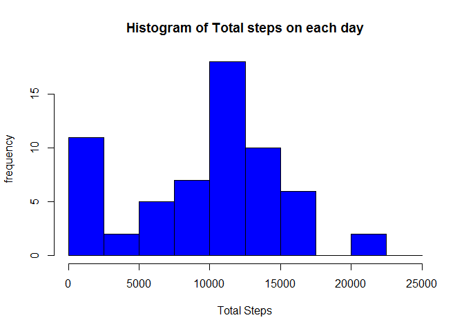
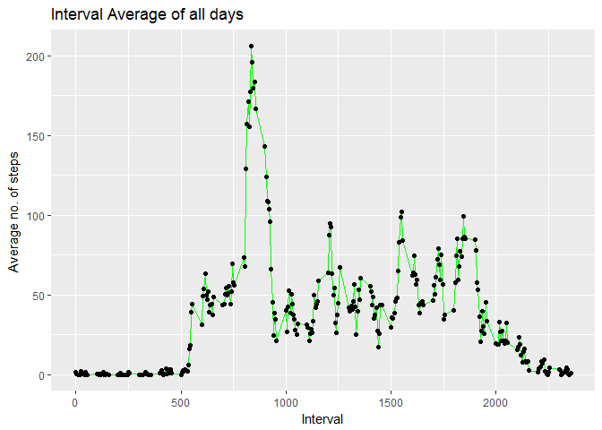
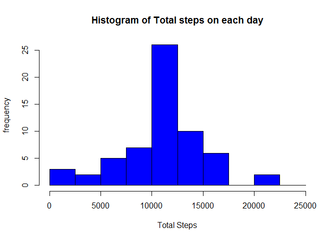
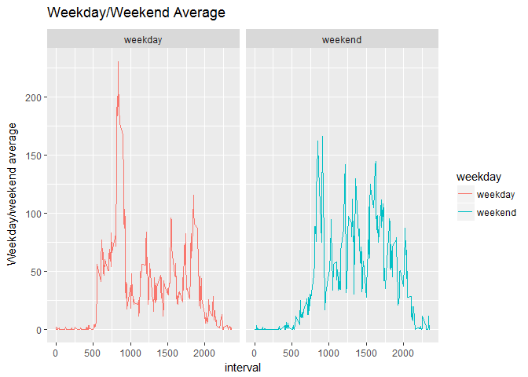

# Reproducible Research: Peer Assessment 1
####Load the data (i.e. read.csv())  
####Process/transform the data (if necessary) into a format suitable for your analysis  

```r
library(gdata)
library(ggplot2)
setwd("C:\\unzipped\\repdata%2Fdata%2Factivity (1)")
F2activity <- read.csv("C:\\unzipped\\repdata%2Fdata%2Factivity (1)\\activity.csv")
F2activity$date <- as.Date(F2activity$date)
```
####Calculate the total number of steps taken per day

```r
Daily_Sum <- aggregate(list('Sum of Steps' = F2activity$steps),by= list('Date' = F2activity$date), FUN = sum, na.rm= TRUE)
```
#### A histogram of the total number of steps taken each day

```r
hist(Daily_Sum$Sum.of.Steps, breaks = seq(from=0, to=25000, by=2500),col = "blue", xlab = "Total Steps" , ylab= "frequency", main = "Histogram of Total steps on each day" )   
```

<!-- -->


#### Calculate and report the mean and median of the total number of steps taken per day

```r
mean(Daily_Sum$Sum.of.Steps, na.rm = TRUE)
```

```
## [1] 9354.23
```

```r
median(Daily_Sum$Sum.of.Steps, na.rm= TRUE)
```

```
## [1] 10395
```
#### Make a time series plot (i.e. type = "l") of the 5-minute interval (x-axis) and the average number of steps   taken,averaged across all days (y-axis)

```r
Int_Avg <- aggregate(list('Avg_no_of_Steps' = F2activity$steps),by= list('interval' = F2activity$interval), FUN = mean, na.rm= TRUE)
head(Int_Avg)
```

```
##   interval Avg_no_of_Steps
## 1        0       1.7169811
## 2        5       0.3396226
## 3       10       0.1320755
## 4       15       0.1509434
## 5       20       0.0754717
## 6       25       2.0943396
```

```r
library(ggplot2)
ggplot(data=Int_Avg, aes(x=Int_Avg$interval, y=Int_Avg$Avg_no_of_Steps, group=1)) +
  geom_line(color="green")+
  labs(title="Interval Average of all days",x="Interval", y = "Average no. of steps ")+
  geom_point()
```

<!-- -->


####Which 5-minute interval, on average across all the days in the dataset, contains the maximum number of steps?

```r
Max_interval_step <- subset(Int_Avg,Int_Avg$Avg_no_of_Steps == max(Int_Avg$Avg_no_of_Steps))
Max_interval_step
```

```
##     interval Avg_no_of_Steps
## 104      835        206.1698
```
####Calculate and report the total number of missing values in the dataset (i.e. the total number of rows with NAs)

```r
missingstepss <- sum(is.na(F2activity$steps))
```
#### Devise a strategy for filling in all of the missing values in the dataset.  

```r
#install.packages(("plyr"))
library(plyr)
#install.packages("Hmisc")
library(Hmisc)
#Create a new dataset that is equal to the original dataset but with the missing data filled in.
FilledF2activity <- ddply(F2activity, "interval", mutate, steps = impute(steps, mean))
FilledF2activity$steps <- round(FilledF2activity$steps,2)
```
####Make a histogram of the total number of steps taken each day and Calculate and report the mean and 
median total number of steps taken per day. Do these values differ from the estimates from the first part of the assignment?

```r
Daily_sum23 <- aggregate(list(Total_Steps = FilledF2activity$steps),by= list(date =FilledF2activity$date),FUN= sum )

hist(Daily_sum23$Total_Steps,breaks = seq(from=0, to=25000, by=2500),col = "blue", xlab = "Total Steps" , ylab= "frequency", main = "Histogram of Total steps on each day")
```

<!-- -->


####mean and median of the imputed data set

```r
mean(Daily_sum23$Total_Steps)
```

```
## [1] 10766.18
```

```r
median(Daily_sum23$Total_Steps)
```

```
## [1] 10766.13
```
####Create a new factor variable in the dataset with two levels - "weekday" and "weekend" indicating whether a given date is a weekday or weekend day.


```r
#install.packages("lubridate")
library(lubridate)
```


```r
weekday <- c("Monday", "Tuesday", "Wednesday", "Thursday", "Friday")
for (i in 1: length(weekdays(FilledF2activity$date)))
{
if (weekdays(FilledF2activity$date[i]) %in% weekday) {FilledF2activity$weekday[i] <- "weekday" } else {FilledF2activity$weekday[i] <- "weekend"  }
}
AvergWEEK <- aggregate(list(Avgsteps = FilledF2activity$steps), by= list(interval = FilledF2activity$interval, weekday =   FilledF2activity$weekday), FUN= mean)

ggplot(AvergWEEK,aes(interval,Avgsteps,fill=weekday, color = weekday)) +
  geom_line(stat="identity") +
  facet_grid(.~weekday,scales = "free",space="free") + 
  labs(x="interval", y=expression("Weekday/weekend average")) + 
  labs(title=expression("Weekday/Weekend Average")) 
```

<!-- -->


